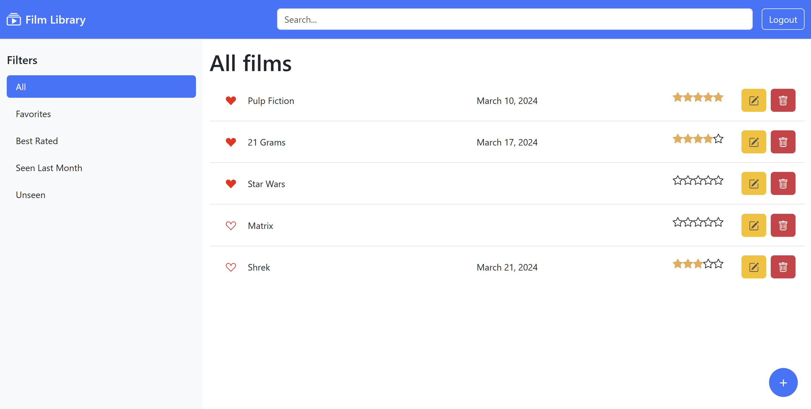

# Film Library


## Description
Developed for the **Web Applications I** course during my Master's degree in Computer Engineering at **Politecnico di Torino**. The goal of this project was to build a full-featured, responsive **Film Library management application**, shifting from plain JavaScript to a modern component-based architecture using **React** for the frontend and a **Node.js** server for the backend API.

## Core Features

* **Interactive UI:** A responsive dashboard to view, add, edit, and delete movies from the collection.
* **Filtering & Search:** Dynamically filter movies by rating, release date, favorites, or custom search criteria.
* **Client-Side Routing:** Smooth, single-page navigation between different application views.
* **State Management:** Clean implementation of React hooks (`useState`, `useEffect`, `useContext`) to manage user sessions and application state.
* **REST API Integration:** Full client-server communication to fetch, create, and modify data persistently.

## Tech Stack & Tools

* **Frontend:** HTML5, CSS3, JavaScript (ES6+), React, Bootstrap / React-Bootstrap
* **Backend:** Node.js (running via `nodemon`)
* **Build Tools:** Vite
* **Data Fetching:** Fetch API

## How to run
First terminal:
```
npm i
cd server
nodemon index.js
```
Second terminal:
```
npm i 
cd client
npm run dev
```